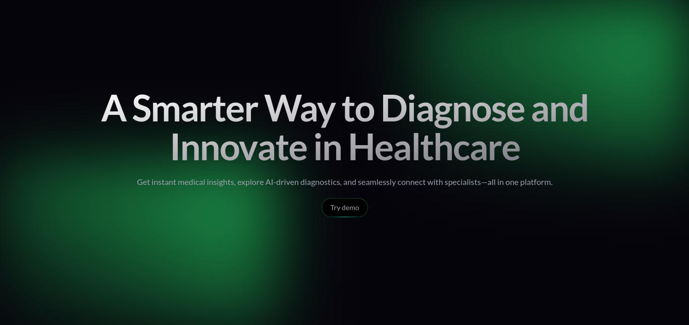

# Medical 🏥

## 🖇 Description

This project is an experimental platform designed to push the boundaries of AI 🧠  and explore its potential across various fields. We're  building a space to research, test, and implement cutting-edge AI technologies like large language models (LLMs) and predictive models. 🚀 

## 🎯 Goals

* 🔬  Research & Development: Dive deep into the latest AI technologies and experiment with them in a controlled environment.
* 🏥  Practical Implementation: Explore how AI can solve real-world problems and improve lives, focusing on applications in healthcare and beyond.
* 🧰  Tool Integration: Create a streamlined dashboard that seamlessly integrates various AI tools, making it easy for developers and researchers to access and use them.

## ⚙️ Components

* 📈  Experimental Dashboard:  Visualize data and metrics to gain insights into the performance of different AI models.
* 🧠  LLMs as Assistants:  Interact with LLMs directly, using them as powerful research assistants to find information and answers.
* 👨‍⚕️  LLMs as Simulators:  Simulate interactions with experts (doctors, etc.) to create a more personalized and helpful experience.
* 🩻  Predictive Models & Classifiers:  Analyze medical images to detect diseases like pneumonia and predict outcomes or trends.

## 🚧 Current Status

The project is in its initial stages of development, but we are actively working on creating the experimental dashboard and integrating the first LLMs.

## ⏭️ Next Steps

* 🧠  Implement predictive models and classifiers to address various challenges.
* 🛠️  Expand dashboard functionalities to make it more versatile and user-friendly.
* ⚙️  Integrate new and emerging AI tools to constantly evolve the platform.

## ⚠️ Notes

* ⚠️  All data used in the project will be fake and simulated to ensure privacy and security.
* 🚫  The platform is for research and exploration, not for clinical use. 

## 🤝 Collaboration

We welcome collaborators with expertise in AI development, data analysis, and user interface design. 

## 📧 Contact

Giovanny A. Jimenez
gjimenezdeza@gmail.com